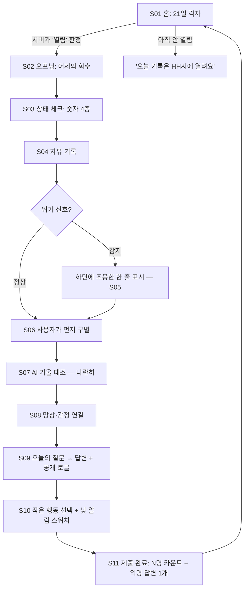
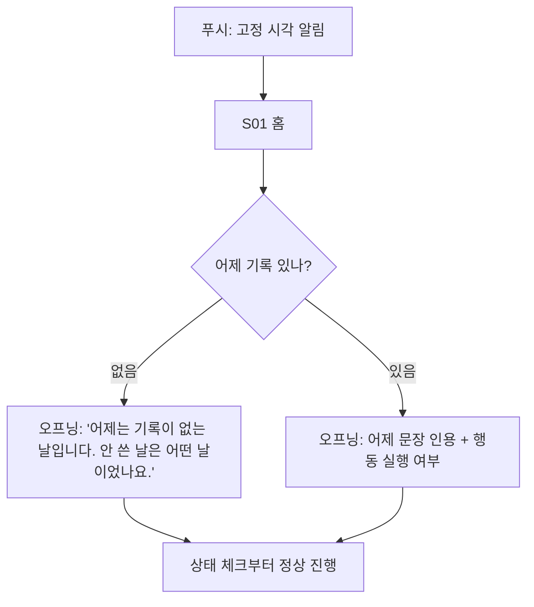
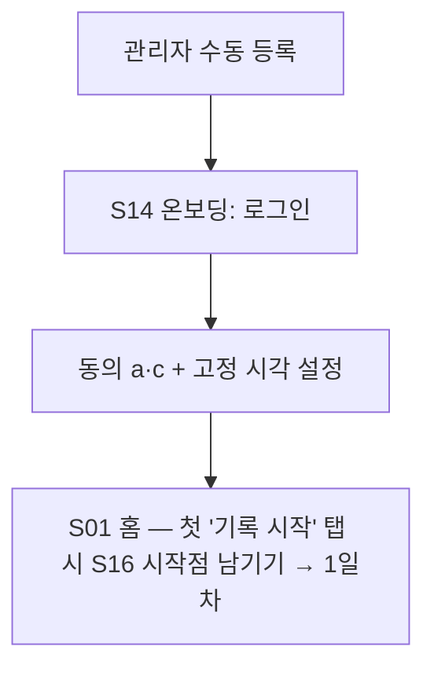
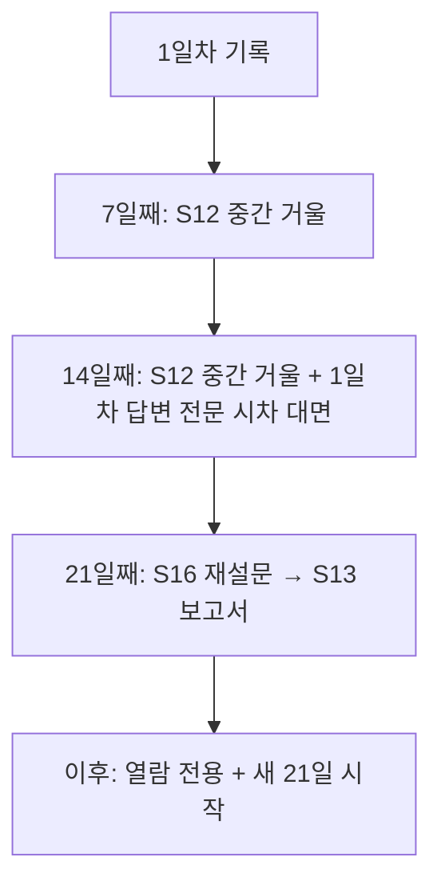
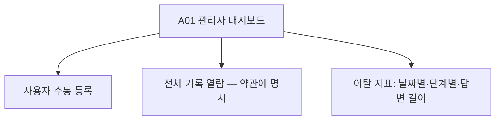

# 유저 플로우 — 오제로의 거울

## 메인 플로우 — 하루 루프 (순서 변경 금지 · 제출 후 뒤로 못 감)

핵심 순서 규칙: **사용자 구별(S06)이 AI 대조(S07)보다 반드시 먼저.** AI가 먼저 답을 주면 훈련이 아니라 의존이 된다. 타인의 답변(S11)은 제출 전에는 어떤 형태로도 노출되지 않는다.

## 재방문 플로우 — 빠진 날 (실패가 아니라 데이터)

- 연속 기록이 깨졌다는 표시·문구 일절 금지.
- 3일 연속 미기록이면 저녁 푸시의 문구만 바뀐다 (추가 발송 없음): "3일째 기록이 없습니다. 안 쓴 날들도 데이터입니다."

## 첫 방문 플로우 (블럭 5 이후)

## 21일 여정 플로우

## 운영자 플로우

## 화면 색인 (상세는 화면별 파일로)

| 화면 | 파일 | 목적 한 가지 | 만드는 블럭 |
|---|---|---|---|
| S01 홈 격자 달력 | screens/S01-홈달력.md | 오늘 위치 확인과 진입 | 블럭 7 (임시판은 블럭 1) |
| S02 오프닝 | screens/S02-오프닝.md | 어제의 회수 | 블럭 3 |
| S03 상태 체크 | screens/S03-상태체크.md | 숫자 4종 10초 입력 | 블럭 1 |
| S04 자유 기록 | screens/S04-자유기록.md | 오늘 하루 쓰기 | 블럭 1 |
| S05 위기 — 조용한 한 줄 | screens/S05-위기안내.md | 비상구 정보 (루프 무중단 · 구성 요소) | 블럭 4 |
| S06 구별 | screens/S06-구별.md | 사용자가 먼저 사실·망상 나누기 | 블럭 2 |
| S07 AI 대조 | screens/S07-거울대조.md | 나란히 보여주기 (채점 아님) | 블럭 2 |
| S08 감정 연결 | screens/S08-감정연결.md | 망상→감정 잇기 | 블럭 2 |
| S09 질문·답변 | screens/S09-질문답변.md | 원문 인용 질문과 답변 | 블럭 3 |
| S10 작은 행동 | screens/S10-작은행동.md | 내일의 행동을 사용자가 정함 | 블럭 3 |
| S11 제출 완료 | screens/S11-제출완료.md | 동료 존재감 | 블럭 9 (임시판은 블럭 3) |
| S12 중간 거울 | screens/S12-중간거울.md | 7·14일 사실 제시 + 시차 대면 | 블럭 7 |
| S13 보고서 | screens/S13-보고서.md | 21일 원문 인용 보고서 | 블럭 7 |
| S14 온보딩 | screens/S14-온보딩.md | 로그인·동의·시각 | 블럭 5 |
| S15 설정 | screens/S15-설정.md | 시각·알림·삭제 | 블럭 5 |
| S16 시작점 남기기 | screens/S16-시작점.md | 전후 비교의 자 (첫 기록 직전·21일째) | 블럭 5 |
| A01 관리자 | screens/A01-관리자.md | 수동 등록·열람·지표 | 블럭 6 |
