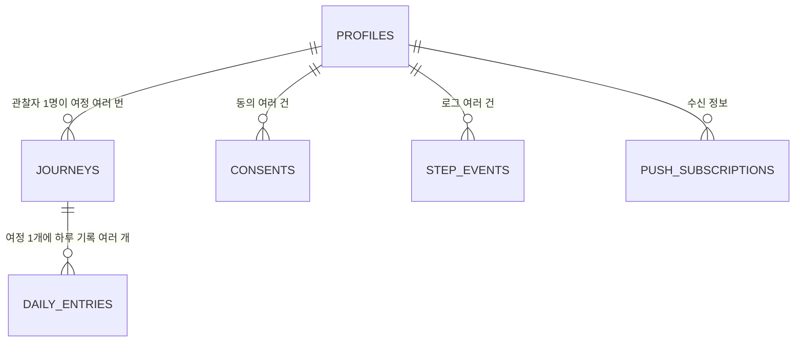

# DB 설계 — 오제로의 거울 (초안)

> 지시서 7번: "구조화 저장이 이 앱의 해자다." 모든 기록은 한 덩어리 텍스트가 아니라 단계별 별도 필드.
> 스키마는 "나중에 바꿀 수 없다"고 간주하고 설계한다. 미결정 항목 전부 확정됨 (2026-07-05, 06-decisions.md) — 블럭 1에서 이 SQL 그대로 실행.

## 표 목록

| 표 | 무엇 | 소유 | 규모 가늠 (사용자 100명 기준) |
|---|---|---|---|
| profiles | 관찰자 정보 (익명 코드·기록 시각) | 본인 | 100행 |
| journeys | 여정 — 코스 1회 수행 (v1: 21일 거울. 추후: 35일 심화, "새 21일"도 새 여정) | 본인 | 150행 |
| consents | 동의 이력 (종류·버전·시각) | 본인 | 수백 행 |
| daily_entries | 하루 기록 — 10단계 전 필드 구조화 | 본인 | 2,100행 (100명 × 21일) |
| step_events | 단계별 진입·제출 로그 (이탈 측정) | 본인 | 수만 행 |
| assessments | 시작점·21일째 설문 (WHO-5 · 탈중심화 척도) | 본인 | 400행 (100명 × 2시점 × 2종) |
| push_subscriptions | 웹 푸시 수신 정보 (브라우저 구독) | 본인 | 100행 |

## 관계 도식



## 표 상세: profiles (관찰자)

| 항목 | 종류 | 필수 | 중복금지 | 비고 |
|---|---|---|---|---|
| user_id | uuid | O | O | Supabase Auth 계정과 잇는 꼬리표 (기본키) |
| observer_code | 글자 | O | O | 익명 코드 'o'+3자리 (예: o056) — 번호표 기계(시퀀스)로 자동 발급. **레터에서 o055까지 발급됨 → 앱은 o056부터 시작.** 기존 수료자는 관리자 등록 시 기존 코드 수동 지정 (중복 검사) |
| record_hour | 숫자(0~23) | O | | 사용자 지정 고정 시각 (시 단위). 변경 시 다음날부터 적용 |
| timezone | 글자 | O | | v1은 'Asia/Seoul' 고정 · (시작일은 journeys 표로 이동) |
| is_admin | 참/거짓 | O | | 운영자 1인 표시. 기본 false |
| created_at / deleted_at | 시각 | | | soft delete — 완전 삭제 요청 시 실삭제 흐름 별도 |

## 표 상세: consents (동의 3종 — 지시서 7번)

| 항목 | 종류 | 필수 | 비고 |
|---|---|---|---|
| id | 번호(자동) | O | |
| user_id | uuid | O | 꼬리표 |
| consent_type | 글자 | O | 'ai_analysis'(a: AI 전송·분석) / 'asset_use'(c: 익명화 활용). (b) 답변 공개는 건별 → daily_entries에 |
| policy_version | 글자 | O | 동의 문서의 버전 |
| consented_at | 시각 | O | 동의한 순간 |

## 표 상세: journeys (여정 — 코스 1회 수행. 35일 심화와 "새 21일 시작"의 자리)

| 항목 | 종류 | 필수 | 비고 |
|---|---|---|---|
| id / user_id | | O | 꼬리표 |
| course | 글자 | O | v1은 'mirror21'(21일 거울)만. 추후 'scalpel35'(35일 심화 — 거울+메스) 등 |
| start_date | 날짜 | | 이 여정의 1일차 = 첫 기록 제출일 (첫 제출 때 기록) |
| status | 글자 | O | 'active' / 'done' — 동시에 active 여정은 1개만 (앱 로직) |
| created_at | 시각 | O | |

## 표 상세: daily_entries (하루 기록 — 구조화 저장의 본체)

| 항목 | 종류 | 필수 | 비고 |
|---|---|---|---|
| id | 번호(자동) | O | |
| user_id | uuid | O | 꼬리표 |
| journey_id | 번호 | O | 여정 꼬리표 — 이 기록이 어느 코스·몇 회차 여정의 것인지 |
| entry_date | 날짜 | O | user_id와 조합 중복금지 (하루 1회 강제) |
| day_no | 숫자 | O | 여정 시작부터 1~N (21일 코스는 1~21) — 전후 비교 조회(1·7·14·21)의 걸쇠 |
| score_mood / score_emotion / score_energy / score_sleep | 숫자 | O | 단계 2 "오늘의 눈금" — 전부 0~10 (기분 / 감정 세기 / 체력 / 지난밤 잠의 질) |
| emotion_label | 글자 | O | 오늘 가장 컸던 감정 이름 (고정 목록 10개 — S03 명세) |
| free_text | 글 | O | 단계 3 자유 기록 (원문 — 모든 인용의 원천) |
| user_split | jsonb | | 단계 5 사용자 구별 — [{src, label}] (src = 사용자가 나눈 조각 원문 그대로 · label = fact/delusion/none) |
| ai_split | jsonb | | 단계 6 AI 대조 — [{src, text, label, category}] (08-ai-prompts 1번 · category는 내부용, 화면 노출 금지) |
| delusion_emotion_links | jsonb | | 단계 7 연결 — [{delusion_quote, emotion_field}] |
| question_text | 글 | | 단계 8 질문 전문 |
| question_quote_date / question_quote_text | 날짜/글 | | 인용된 원문의 출처 날짜와 원문 (지시서: 출처 날짜 포함 저장) |
| answer_text | 글 | | 단계 9 답변 |
| answer_shared | 참/거짓 | O | 건별 공개 토글. 기본 false |
| answer_share_consented_at / answer_share_version | 시각/글자 | | (b) 동의의 시각·버전 — 켠 경우만 |
| action_text | 글 | | 단계 10 행동 (원문 — 낮 리마인더가 이걸 그대로 인용) |
| action_reminder | 참/거짓 | O | 낮 알림 스위치. 기본 false |
| action_result | 글자 | | 'done'/'partial'/'skipped' — 다음날 오프닝에서 기록 |
| crisis_detected | 참/거짓 | O | 단계 4 판정. 기본 false |
| last_step | 숫자 | O | 진행 위치 (이어하기 + 단계별 이탈 측정) |
| submitted_at | 시각 | | 최종 제출 시각 (null이면 미완) — N명 카운트 기준 |
| created_at / updated_at / deleted_at | 시각 | | |

## 표 상세: step_events (측정 로깅 — 지시서 7번 "처음부터")

| 항목 | 종류 | 비고 |
|---|---|---|
| id / user_id / entry_date / day_no | | 꼬리표들 |
| step | 숫자 | 1~10 |
| event | 글자 | 'enter' / 'submit' |
| created_at | 시각 | 날짜별·단계별 이탈이 이 표에서 나옴. 답변 길이 추세는 daily_entries에서 |

## 표 상세: assessments (시작점·21일째 설문 — 전후 비교의 자)

| 항목 | 종류 | 필수 | 비고 |
|---|---|---|---|
| id / user_id | | O | 꼬리표 |
| phase | 글자 | O | 'day0'(첫 기록 직전) / 'day21'(보고서 직전) |
| instrument | 글자 | O | 'who5' / 'decentering' — 문항 원문·응답 방식은 검증판 그대로 (수정 금지) |
| answers | jsonb | O | 문항별 응답 |
| total_score | 숫자 | | 합계 (서버 계산) |
| created_at | 시각 | O | |

## 권한 (RLS = 창고 문 앞의 출입 규칙)

| 표 | 읽기 | 쓰기 | 수정·삭제 |
|---|---|---|---|
| profiles | 본인 + 관리자 | 본인(가입 시) | 본인 · 공개(anon) 삭제·수정 금지 |
| journeys | 본인 + 관리자 | 본인 | 본인 (status 갱신만) |
| consents | 본인 + 관리자 | 본인 | 수정 없음 (이력은 새 행으로) |
| daily_entries | 본인 + 관리자 | 본인 | 제출 후 수정 완전 불가 (오타 포함) — 앱+정책 이중 강제 |
| step_events | 본인 + 관리자 | 본인 | 수정·삭제 없음 |
| assessments | 본인 + 관리자 | 본인 | 수정 없음 (시점 기록이므로) |
| 공유 답변 | 아래 "공유 층" 참조 — 직접 읽기 금지 | — | — |

- **격리 층 (지시서 6번, 예외 없음)**: 자유 기록·구별·상태 숫자는 본인+관리자 외 어떤 경로로도 비노출. 타인이 읽을 수 있는 정책을 만들지 않는다.
- **공유 층**: 공개 동의된 답변 1개는 클라이언트가 표를 직접 읽지 않고 **서버(주방)를 거쳐서만** 받는다 — 서버가 "오늘 제출했나"를 확인한 뒤 answer_shared=true인 타인 답변 1개만 골라 관찰자 코드와 함께 반환. 일괄 공개 정책·공개 뷰 없음.
- 관리자 열람: is_admin=true 사용자에게만 여는 select 정책 (약관에 열람 사실 명시).
- RLS 켜는 시점: 표 생성 때부터 켠다. 블럭 1~4(로그인 없는 단계)는 서버 경유 + 테스트 계정 1개로 개발 → 상세는 06-decisions.md.

## 삭제 정책

- 평상시: soft delete (deleted_at 표시) — 킷 규칙.
- 사용자 삭제 요청: 완전 삭제 흐름 (지시서 7번) — S15에서 요청 → 확인 절차 → 전 표에서 해당 user_id 실삭제. 공개했던 답변도 함께 사라짐.

## 연결 규칙 (FK 제약 없음 — 킷 규칙)

- 관계는 꼬리표 컬럼(user_id 등)으로만. FOREIGN KEY 제약은 걸지 않는다. 정합성은 soft delete + 앱 로직.
- FK가 없으면 Supabase 중첩 조회가 안 되므로 조인은 두 번 나눠 읽거나 뷰로.
- N+1 금지: 관리자 대시보드 목록 등은 in 조회·뷰로 한 번에.

## 검색·정렬·인덱스

- daily_entries: (user_id, entry_date) 유니크 인덱스 — 하루 1회 강제 + 조회 걸쇠
- daily_entries: (user_id, day_no) — 1·7·14·21 비교 조회
- daily_entries: (entry_date, submitted_at) — "오늘 N명" 카운트와 익명 답변 고르기
- step_events: (user_id, entry_date)

## 초기 데이터(시드)

- 없음. 관리자 계정 1개만 수동 지정 (profiles.is_admin).

## SQL 초안 (Supabase — 지금 실행하지 않는다. 블럭 1 첫 스텝에서 사용자가 SQL Editor에 붙여넣어 실행)

```sql
-- 익명 코드 번호표 기계 — 레터에서 o055까지 발급됨, 앱은 o056부터 이어받는다
create sequence observer_code_seq start 56;

-- 관찰자
create table profiles (
  user_id uuid primary key,          -- Auth 계정 꼬리표 (FK 제약 없음)
  observer_code text not null unique,  -- 'o' + 3자리 (예: o056). 서버가 시퀀스에서 발급, 기존 수료자는 관리자가 기존 코드 지정
  record_hour smallint not null default 21,
  timezone text not null default 'Asia/Seoul',
  is_admin boolean not null default false,
  created_at timestamptz not null default now(),
  deleted_at timestamptz
);

-- 여정 — 코스 1회 수행 (21일 거울 / 추후 35일 심화 / "새 21일"도 새 여정으로)
create table journeys (
  id bigint generated always as identity primary key,
  user_id uuid not null,
  course text not null default 'mirror21',   -- v1은 'mirror21'만. 추후 'scalpel35'
  start_date date,                           -- 이 여정의 1일차 = 첫 기록 제출일
  status text not null default 'active',     -- 'active' | 'done'
  created_at timestamptz not null default now()
);

-- 동의 이력 (a·c종 — b종은 daily_entries 건별)
create table consents (
  id bigint generated always as identity primary key,
  user_id uuid not null,
  consent_type text not null,        -- 'ai_analysis' | 'asset_use'
  policy_version text not null,
  consented_at timestamptz not null default now()
);

-- 하루 기록 (구조화 저장의 본체)
create table daily_entries (
  id bigint generated always as identity primary key,
  user_id uuid not null,
  journey_id bigint not null,        -- 여정 꼬리표
  entry_date date not null,
  day_no smallint not null,          -- 여정 기준 1~N
  score_mood smallint, score_emotion smallint,
  score_energy smallint, score_sleep smallint,   -- 오늘의 눈금 4종 (0~10)
  emotion_label text,                            -- 가장 컸던 감정 이름 (고정 목록)
  free_text text,
  user_split jsonb,                  -- [{src, label}] 사용자 구별 (조각 원문 + fact/delusion/none)
  ai_split jsonb,
  delusion_emotion_links jsonb,
  question_text text,
  question_quote_date date,
  question_quote_text text,
  answer_text text,
  answer_shared boolean not null default false,
  answer_share_consented_at timestamptz,
  answer_share_version text,
  action_text text,
  action_reminder boolean not null default false,
  action_result text,                -- 'done' | 'partial' | 'skipped'
  crisis_detected boolean not null default false,
  last_step smallint not null default 0,
  submitted_at timestamptz,
  created_at timestamptz not null default now(),
  updated_at timestamptz not null default now(),
  deleted_at timestamptz,
  unique (user_id, entry_date)
);
create index idx_entries_user_day on daily_entries (user_id, day_no);
create index idx_entries_date_submitted on daily_entries (entry_date, submitted_at);
create index idx_entries_journey on daily_entries (journey_id);

-- 단계 로그
create table step_events (
  id bigint generated always as identity primary key,
  user_id uuid not null,
  entry_date date not null,
  day_no smallint not null,
  step smallint not null,
  event text not null,               -- 'enter' | 'submit'
  created_at timestamptz not null default now()
);
create index idx_events_user_date on step_events (user_id, entry_date);

-- 시작점·21일째 설문
create table assessments (
  id bigint generated always as identity primary key,
  user_id uuid not null,
  phase text not null,               -- 'day0' | 'day21'
  instrument text not null,          -- 'who5' | 'decentering'
  answers jsonb not null,
  total_score smallint,
  created_at timestamptz not null default now()
);

-- RLS: 표 생성 때부터 켠다
alter table profiles enable row level security;
alter table journeys enable row level security;
alter table consents enable row level security;
alter table daily_entries enable row level security;
alter table step_events enable row level security;
alter table assessments enable row level security;

-- 본인 것만 (블럭 5에서 Auth 붙일 때 활성 — 정책 골격)
create policy "own read"  on daily_entries for select using (auth.uid() = user_id);
create policy "own write" on daily_entries for insert with check (auth.uid() = user_id);
create policy "own update" on daily_entries for update using (auth.uid() = user_id);
-- 주의: 공개(anon) DELETE/UPDATE 정책은 만들지 않는다 (치명 2)
-- 관리자 열람 정책·나머지 표 정책은 블럭 5 스텝에서 같은 방식으로 추가
```
