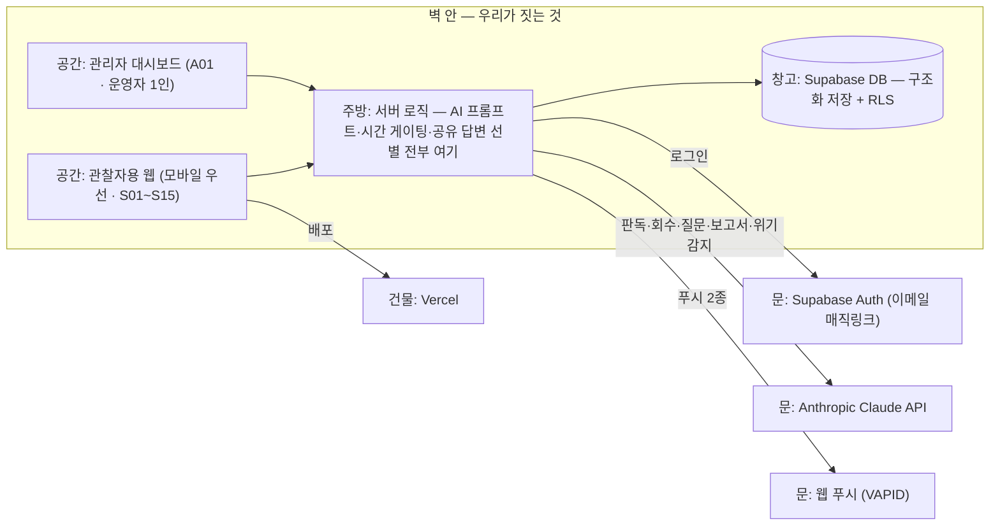

# 시스템 지도 — 오제로의 거울

> 이 앱이 어떤 부품으로 되어 있고, 밖에서 뭘 빌려오는지 한 장.
> 식당 비유: 홀(화면) · 주방(서버 로직) · 창고(DB) · 문(외부 서비스 창구) · 건물(배포).

## 한눈 도식

주방에 반드시 있어야 하는 것 (클라이언트 금지 항목 — 지시서 8번):
- 모든 AI 프롬프트 (네트워크 응답에도 노출 금지) — Next.js 서버 라우트 (결정 2026-07-05)
- 24시간 게이팅 판정 (클라이언트 시간 판정 금지)
- 공유 답변 선별 ("오늘 제출했나" 확인 후 1개만)
- AI 인용의 원문 일치 검증

## 누가 들어오나 (역할 → 공간)

| 역할 | 들어가는 공간 | 할 수 있는 일 |
|---|---|---|
| 관찰자 (퀘스천 레터 수료자) | 관찰자용 웹 | 하루 루프 기록 · 본인 기록 열람 · 답변 건별 공개 · 삭제 요청 |
| 운영자 (1인) | 관리자 대시보드 | 사용자 수동 등록 · 전체 기록 열람(약관 명시) · 이탈 지표 |

## 빌려오는 것 (문 목록)

| 문(서비스) | 무엇을 대신해주나 | 어느 기능에 | .env 키 | 과금 |
|---|---|---|---|---|
| Supabase | 창고(DB) + 경비실(로그인·RLS) | 구조화 저장 전부, 인증 | SUPABASE_URL · SUPABASE_ANON_KEY · SUPABASE_SERVICE_ROLE_KEY(서버 전용) | 무료로 시작 |
| Anthropic Claude | AI 거울의 두뇌 | 대조·질문 생성·중간 거울·보고서·위기 감지 (5개 동작) | ANTHROPIC_API_KEY (서버 전용) | 쓴 만큼 |
| Vercel | 건물(배포) | 전체 | 깃허브 연결 | 무료로 시작 |
| 웹 푸시 | 저녁 질문·낮 리마인더 배달 (브라우저 알림) | 푸시 2종 | VAPID_PUBLIC_KEY · VAPID_PRIVATE_KEY | 무료 |
| TossPayments (마지막) | 결제 | 블럭 10 | 테스트 키부터 (실키는 사업자등록 필요) | 수수료 |
| Resend (조건부) | 이메일 발송 대행 — Supabase 기본 메일은 시간당 발송 제한이 낮아, 매직링크를 대중에게 열 때 필요 | 블럭 3 로그인 (공개 확장 시) | RESEND_API_KEY | 무료로 시작 |

## 이번 스코프에서 안 여는 문

- 카카오톡 채팅·비공식 연동 — 킷 규칙(공식 API 없는 자동화 금지)
- 벡터 DB · 파인튜닝 — 지시서 11번 (v1 밖)
- 이메일 마케팅 도구 — 알림은 푸시 2종뿐 (지시서 5번)
- Cloudflare — 도메인·대용량 파일 수요 없음 (생기면 그때 결정)
